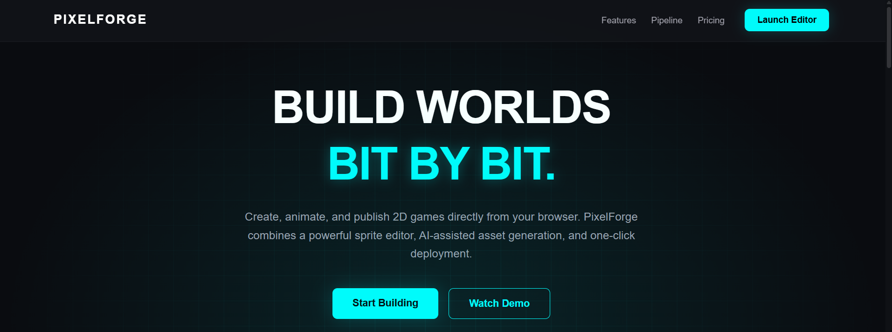
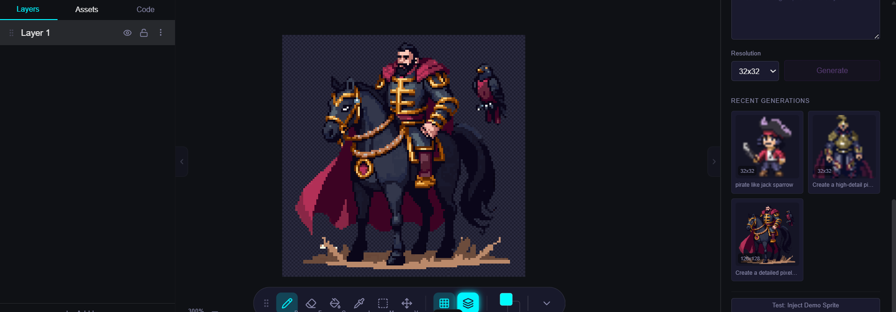
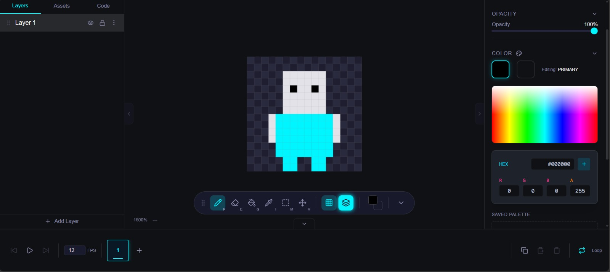

# PixelForge 🚀

PixelForge is a professional, browser-based 2D game builder designed for rapid prototyping and high-performance pixel art creation. Build, animate, and publish worlds directly from your browser with AI-assisted workflows.



## ✨ Key Features

- **🎨 Sprite Studio**: Pixel-perfect manipulation with multi-layer compositing and GPU-accelerated rendering.
- **🤖 AI Copilot**: Generate production-ready pixel art using PixelLab AI, Claude, and Gemini.
- **🏗️ Scene Builder**: Visual level design with dynamic tilemapping and physics-aware placement.
- **📦 Asset Library**: Centralized, taggable management for all your game assets.
- **⚡ One-Click Deploy**: Instant deployment to Vercel with automatic optimization.

## 🛠️ Technology Stack

- **Framework**: [Next.js 14](https://nextjs.org/) (App Router)
- **Styling**: [Tailwind CSS](https://tailwindcss.com/)
- **State Management**: [Zustand](https://zustand-demo.pmnd.rs/)
- **Canvas Rendering**: [Konva.js](https://konvajs.org/)
- **Backend/Auth**: [Supabase](https://supabase.com/)
- **AI Integration**: PixelLab API, Google Gemini, Anthropic Claude

## 📸 Screenshots

| AI Sprite Generation | Professional Editor |
|----------------------|---------------------|
|  |  |

## 🚀 Getting Started

### Prerequisites

- Node.js 18+ 
- npm / pnpm / bun
- A Supabase project
- PixelLab API Key (Optional, for AI features)

### Installation

1. **Clone the repository**:
   ```bash
   git clone https://github.com/your-username/pixel-forge.git
   cd pixel-forge
   ```

2. **Install dependencies**:
   ```bash
   npm install
   ```

3. **Environment Setup**:
   Create a `.env.local` file in the root directory:
   ```env
   NEXT_PUBLIC_SUPABASE_URL=your_supabase_url
   NEXT_PUBLIC_SUPABASE_ANON_KEY=your_supabase_anon_key
   PIXELLAB_API_KEY=your_optional_server_key
   ```

4. **Run the development server**:
   ```bash
   npm run dev
   ```

## 📖 Documentation

Detailed guides for specific features:
- [PixelLab AI Setup](./src/app/(landing)/docs/pixellab/page.tsx) - How to configure your AI generation keys.

## 🛡️ Security

PixelForge prioritizes user privacy. **All sensitive API keys (like PixelLab) are stored exclusively in your browser's `localStorage`.** We never store your personal integration keys on our servers.

## 📄 License

This project is licensed under the MIT License.
